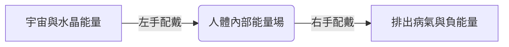

# ✨ 水晶能量隨身手冊 — 種類、功效與搭配指南 ✨

歡迎閱讀《水晶能量隨身手冊》。本手冊是一份完整的個人水晶能量指南，旨在為您提供全面、科學且具溫度的水晶數據庫。本手冊詳細涵蓋了 20 種常見水晶的理化顏色、七大脈輪對應、核心能量功效、適合配戴的職業人群，以及進階的能量組合與保養儀式，方便您隨身查閱與日常實踐。

---

## 📖 目錄
1. [一、 水晶能量科學簡述](#一-水晶能量科學簡述)
2. [二、 20 種常見水晶百科全書](#二-20-種常見水晶百科全書)
3. [三、 進階水晶能量搭配建議（加乘效應）](#三-進階水晶能量搭配建議加乘效應)
4. [四、 水晶配戴守則：左進右出原理](#四-水晶配戴守則左進右出原理)
5. [五、 淨化消磁與意圖設定儀式](#五-淨化消磁與意圖設定儀式)

---

## 一、 水晶能量科學簡述

在身心靈能量醫學中，水晶被視為穩定的**能量振頻共振體**。
從現代物理學角度來看，水晶（特別是石英類水晶）具有獨特的**壓電效應 (Piezoelectricity)**，能夠在受到壓力或震動時產生穩定的微弱電流與電磁波。由於其內部二氧化矽分子結構呈完美的規則排列，水晶能維持恆定不變的「固有振頻」。當人體因焦慮、疲累或負面情緒導致能量場頻率失衡時，配戴水晶能透過「共振原理」協助人體的電磁場逐步恢復平衡與穩定。

---

## 二、 20 種常見水晶百科全書

以下為您整理的 20 種水晶完整數據庫。包含對應之人體七大脈輪（Chakras）與專屬建議：

### 1. 白水晶 (Clear Quartz)
*   **顏色**：無色、全透明
*   **對應脈輪**：頂輪 (Crown Chakra)
*   **核心功效**：能量放大鏡、淨化磁場、排除負能量、提升大腦專注力、平衡身心。
*   **適合職業/人群**：學生、科研人員、創意工作者、冥想練習者。
*   **注意事項**：能量純粹，是所有水晶的能量基底，適合與任何水晶搭配。

### 2. 紫水晶 (Amethyst)
*   **顏色**：紫色、深紫、薰衣草紫
*   **對應脈輪**：眉心輪 (Third Eye Chakra)
*   **核心功效**：開發智慧與直覺、招財（內斂貴人財）、安神助眠、緩解偏頭痛、穩定暴躁情緒。
*   **適合職業/人群**：主管、創業者、文字工作者、經常失眠或壓力大的人。
*   **注意事項**：避免高溫暴曬，容易導致褪色。

### 3. 粉水晶/芙蓉晶 (Rose Quartz)
*   **顏色**：粉紅色、淡粉色
*   **對應脈輪**：心輪 (Heart Chakra)
*   **核心功效**：開拓人緣、招桃花（好緣分）、增進夫妻感情、自我接納、療癒情傷。
*   **適合職業/人群**：業務、客服人員、公關、渴望尋找伴侶或需要療癒內心小孩的人。
*   **注意事項**：主要吸引溫和的人際能量，若需強化個人魅力可搭配草莓晶。

### 4. 黃水晶 (Citrine)
*   **顏色**：金黃色、檸檬黃
*   **對應脈輪**：太陽神經叢 (Solar Plexus Chakra)
*   **核心功效**：招偏財（投資、博弈、非主業收入）、激發自信心與行動力、改善腸胃功能。
*   **適合職業/人群**：投資客、股票交易員、創業者、缺乏自信與執行力者。
*   **注意事項**：天然黃水晶產量稀少，市面上多為紫水晶熱處理而成（雖仍有能量，但天然黃水晶能量更強）。

### 5. 綠幽靈 (Green Phantom)
*   **顏色**：內部含有綠色火山泥包裹物，呈幻影狀
*   **對應脈輪**：心輪 (Heart Chakra)
*   **核心功效**：正財之王（主業收入、事業運）、吸引貴人提攜、幫助事業開疆闢土、緩解心肺壓力。
*   **適合職業/人群**：上班族、公務員、尋求升遷的人、尋找事業合作夥伴者。
*   **注意事項**：需要定期消磁以維持事業磁場乾淨。

### 6. 黑曜石 (Obsidian)
*   **顏色**：黑色（部分帶彩虹眼或金沙、銀沙）
*   **對應脈輪**：海底輪 (Root Chakra)
*   **核心功效**：強力辟邪擋煞、吸收並排除負能量、防小人、避開不潔磁場、穩定急躁能量。
*   **適合職業/人群**：常出入醫院或殯儀館者、敏感體質者、夜班工作者。
*   **注意事項**：吸納性極強，建議**配戴在右手**，且消磁次數需比一般水晶更頻繁。

### 7. 鈦晶/金髮晶 (Rutilated Quartz)
*   **顏色**：水晶內部含有金色板狀或針狀的金紅石包裹體
*   **對應脈輪**：太陽神經叢、海底輪
*   **核心功效**：水晶之王。招正財與偏財、逢凶化吉、提升決策膽識與霸氣、防止負能量入侵。
*   **適合職業/人群**：企業高管、投資家、經常需要做重大決定者。
*   **注意事項**：能量極為剛烈，身體虛弱、脾氣暴躁或睡眠品質極差者不宜配戴睡覺。

### 8. 海藍寶 (Aquamarine)
*   **顏色**：天藍色、海藍色
*   **對應脈輪**：喉輪 (Throat Chakra)
*   **核心功效**：提升溝通與表達能力、增強說服力、平復焦慮與恐懼、旅行平安（守護航海）。
*   **適合職業/人群**：教師、律師、歌手、主播、需要頻繁談判或公開演說者。
*   **注意事項**：溫和的海洋能量，適合與白水晶搭配以放大功效。

### 9. 月光石 (Moonstone)
*   **顏色**：乳白色、帶藍色或彩色光暈
*   **對應脈輪**：眉心輪、頂輪
*   **核心功效**：戀人之石。招正緣、守護愛情、平緩女性經期焦慮、提升陰性溫柔特質、助眠。
*   **適合職業/人群**：女性、情侶、單身尋求正緣者、失眠及情緒敏感者。
*   **注意事項**：能量溫柔，可戴著睡覺以幫助安眠。

### 10. 拉長石 (Labradorite)
*   **顏色**：灰黑色、帶有炫目的藍綠色或金色光暈
*   **對應脈輪**：喉輪、頂輪
*   **核心功效**：靜心與靈魂連結、尋找靈魂伴侶、緩解肉體疲勞、激發潛在創意、清理陳舊氣場。
*   **適合職業/人群**：設計師、藝術家、加班疲憊的上班族、身心靈工作者。
*   **注意事項**：低調但能量深沉，光暈越明顯其能量活性越好。

### 11. 茶晶/煙水晶 (Smoky Quartz)
*   **顏色**：半透明煙褐色、棕色
*   **對應脈輪**：海底輪 (Root Chakra)
*   **核心功效**：接地能量 (Grounding)、踏實沉穩、過濾焦慮與抑鬱、提升男女性能量。
*   **適合職業/人群**：情緒容易浮躁者、缺乏安全感者、需要高度沉著冷靜的工作者。
*   **注意事項**：能有效將負面能量導向大地，是很好的基礎防護石。

### 12. 草莓晶 (Strawberry Quartz)
*   **顏色**：粉紅色帶有紅色點狀包裹物，狀似草莓
*   **對應脈輪**：心輪 (Heart Chakra)
*   **核心功效**：主動招桃花、提升個人魅力、主動出擊的愛情運、增進人際和諧。
*   **適合職業/人群**：業務人員、渴望脫單的單身男女、公關工作者。
*   **注意事項**：相較於粉晶的被動包容，草莓晶的愛情能量更具主動吸引力。

### 13. 綠髮晶 (Green Rutilated Quartz)
*   **顏色**：內部含有綠色針狀電氣石包裹體
*   **對應脈輪**：心輪
*   **核心功效**：主攻事業運與升官發財、增強工作運勢、化解職場上的小人與嫉妒。
*   **適合職業/人群**：創業者、正在尋找工作或準備升學考試的人。
*   **注意事項**：幫助佩戴者打開心胸，接納事業上的挑戰。

### 14. 紅紋石 (Rhodochrosite)
*   **顏色**：玫瑰紅色，帶有白色條紋
*   **對應脈輪**：心輪
*   **核心功效**：愛神之石。吸引熱烈的愛情與靈魂伴侶、深度療癒心靈創傷、增添熱情與活力。
*   **適合職業/人群**：渴望真摯愛情的人、經歷過感情創傷需要療癒的人。
*   **注意事項**：硬度較低，佩戴時應避免碰撞及化學洗劑。

### 15. 金太陽石 (Sunstone)
*   **顏色**：橙紅色、內部含有雲母片，帶有金色閃光
*   **對應脈輪**：太陽神經叢、臍輪
*   **核心功效**：注入正向陽光能量、驅散憂鬱與悲傷、招財（偏財）、提升權威感與領導力。
*   **適合職業/人群**：團隊領袖、經常感到自卑或情緒低落的人、自由職業者。
*   **注意事項**：磁場溫暖強大，能辟邪防小人。

### 16. 石榴石 (Garnet)
*   **顏色**：酒紅色、深紅黑色
*   **對應脈輪**：海底輪
*   **核心功效**：氣血之石。促進血液循環、恢復體力、調理女性生理機能、增添個人自信與魅力。
*   **適合職業/人群**：長期熬夜者、手腳冰冷者、女性上班族。
*   **注意事項**：能量沉穩，建議長期佩戴以達到潛移默化的調理效果。

### 17. 青金石 (Lapis Lazuli)
*   **顏色**：深藍色，常帶有金色黃鐵礦（金沙）與白色方解石
*   **對應脈輪**：眉心輪、喉輪
*   **核心功效**：冷靜思考、增強洞察力與智慧、平復心靈創傷、辟邪護身。
*   **適合職業/人群**：決策者、創意總監、哲學研究者、容易焦慮失序者。
*   **注意事項**：屬於高振頻心靈石，戴著冥想能快速進入靜心狀態。

### 18. 葡萄石 (Prehnite)
*   **顏色**：淡綠色、黃綠色，質地溫潤如葡萄果肉
*   **對應脈輪**：心輪
*   **核心功效**：希望之石。思考清晰、緩解心靈壓力、招正財、排毒與促進新陳代謝。
*   **適合職業/人群**：高壓工作者、醫護人員、身心容易疲憊者。
*   **注意事項**：能量清新柔和，具有極佳的撫慰氣場效果。

### 19. 黑髮晶 (Black Rutilated Quartz)
*   **顏色**：水晶內部含有黑色針狀或髮絲狀電氣石（黑碧璽）
*   **對應脈輪**：海底輪
*   **核心功效**：領袖石。防小人、辟邪擋煞、排除身體病氣、提升領導能力與魄力。
*   **適合職業/人群**：主管、經常需要出差者、出入雜亂環境者。
*   **注意事項**：磁場強勁，具備很強的反彈負能量磁場效力。

### 20. 舒俱徠石 (Sugilite)
*   **顏色**：紫色、紅紫色、粉紫色，不透明
*   **對應脈輪**：眉心輪、頂輪
*   **核心功效**：防癌與排毒之石。極強的心靈防護罩、提升免疫力、化解重大業障與負面心結、啟發靈性智慧。
*   **適合職業/人群**：亞健康人群、重病康復期者、靈修及高敏感族群。
*   **注意事項**：價格昂貴且極為稀有，能量高頻，需佩戴者維持善良利他的心念與其共鳴。

---

## 三、 進階水晶能量搭配建議（加乘效應）

將不同水晶搭配佩戴，可以產生「協同效應」（Synergy Effect），全面提升特定運勢：

| 目標功能 | 水晶搭配組合 | 搭配原理與加乘效果 |
| :--- | :--- | :--- |
| **💰 事業正財（創業者/業務）** | **綠幽靈 + 鈦晶** | 綠幽靈專攻正財運與事業貴人，鈦晶則注入無比霸氣、行動力與財路膽識。兩者結合為「正偏財全面開拓」的至尊組合。 |
| **📈 投資守財（博弈/投資）** | **黃水晶 + 茶晶** | 黃水晶強效吸引偏財與機會，茶晶則帶來極度理智、接地踏實的沉穩氣場，能避免衝動投資，將賺來的財富「牢牢鎖住」。 |
| **💕 甜蜜正緣（脫單/招桃花）** | **粉水晶 + 月光石** | 粉水晶擴展人際關係與魅力，月光石則溫柔吸引心靈契合的「正緣」與「靈魂伴侶」。此組合最適合單身求姻緣。 |
| **🤝 職場好人緣（化解衝突）** | **草莓晶 + 海藍寶** | 草莓晶增加人際親和力與個人魅力，海藍寶強化溝通技巧、消除表達緊張。此組合最適合需要團隊協作與跨部門溝通的職場環境。 |
| **🛡️ 頂級辟邪防小人（護身磁場）**| **黑曜石 + 白水晶** | 黑曜石強效吸納人體與環境的負能量、防小人，白水晶則負責源源不絕注入光明的純淨能量，形成銅牆鐵壁般的個人能量防護罩。 |
| **🧠 智慧與專注力（考生/決策者）**| **紫水晶 + 青金石** | 紫水晶開拓眉心輪直覺與專注力，青金石冷靜理智思考。兩者搭配能消除思緒雜亂，帶來清晰如鏡的決策力。 |
| **🧘 身心靈療癒（緩解焦慮）** | **葡萄石 + 拉長石** | 葡萄石安撫心輪焦慮與疲倦，拉長石清理陳舊負面氣場並連結內在。此組合是極佳的深層壓力釋放與睡眠伴侶。 |

---

## 四、 水晶配戴守則：左進右出原理

在水晶能量配戴學中，遵循 **「左進右出」** 的能量循環原則：

### 1. 左手配戴：吸納性水晶 (Attracting)
*   **原理**：人體氣場通常由左側流入，右側流出。左手適合佩戴「希望吸收到體內」的水晶能量。
*   **適合左手的水晶**：
    *   **財運**：鈦晶、黃水晶、綠幽靈、金太陽石。
    *   **感情人緣**：粉水晶、月光石、草莓晶、紅紋石。
    *   **智慧學業**：紫水晶、青金石。

### 2. 右手配戴：放射性/排除性水晶 (Projecting/Releasing)
*   **原理**：右手負責將人體體內的病氣、濁氣、壓力以及不潔的負能量向外排出。
*   **適合右手的水晶**：
    *   **避邪擋煞**：黑曜石、黑髮晶、茶晶。
    *   *註：黑曜石通常強烈建議戴在右手，以利於吸納排除人體排除的晦氣；若去醫院等重度磁場混亂處，可改戴左手防禦，但事後必須徹底消磁。*

---

## 五、 淨化消磁與意圖設定儀式

水晶會與周圍磁場進行能量交換。新買的水晶、或佩戴 1~2 週後的水晶，都必須經過「消磁」來重置其能量狀態。

### 1. 常見消磁方法
1.  **白水晶碎石法（最推薦、最方便）**：
    *   將天然白水晶碎石鋪在玻璃或陶瓷碗中。
    *   將佩戴完的水晶手鏈放置於碎石上，靜置 **4 小時以上**（過夜效果更佳）。
    *   *註：碎石本身也需要每隔一個月用清水洗淨、曬太陽以重複使用。*
2.  **月光淨化法**：
    *   在農曆十五月圓前後的夜晚，將水晶放置在窗台，使其接受月光照射一整晚。
    *   此法極為溫和，特別適合粉晶、月光石與拉長石。
3.  **煙燻淨化法**：
    *   使用天然白色鼠尾草 (White Sage)、秘魯聖木 (Palo Santo) 或檀香點燃。
    *   將水晶在產生的煙霧中環繞薰香 3-5 圈，即可快速淨化磁場。

### 2. 意圖設定儀式 (Setting Intentions)
消磁完成後，請為您的水晶設定專屬意圖，讓水晶與您的意識頻率精準對接：

1.  **靜心**：找一個安靜的空間，閉上雙眼，深呼吸三次。
2.  **連結**：雙手捧著淨化好的水晶，放在心口（心輪）位置。
3.  **冥想與宣告**：在腦海中想像一束光照入水晶，並用堅定的語氣在心中或唸出聲宣告：
    > *「純淨的水晶，我邀請你與我的能量共鳴。請協助我增強內在的自信，吸引正向的事業機會與豐盛的財富，並在日常中保持平靜與智慧。感謝你的陪伴。」*
4.  **感謝**：向水晶致謝，隨後即可正式佩戴。

---

> 📌 **隨身小提示**：水晶是一面心靈鏡子。當您維持善良、積極且和諧的心境時，水晶的共振能量將會以最顯著的狀態呈現在您的日常生活中。祝您在能量探索的旅程中收穫滿滿的豐盛與平靜！💎
